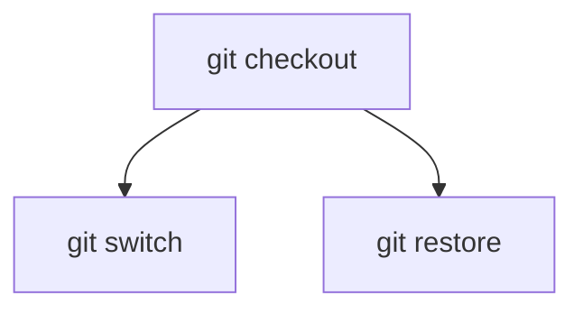

# Construire un outil de CLI userfriendly

## Inventons la **C**ommand **L**ine e**X**perience !

<div class="mt-10">
  
  Nicolas Lepage - <a href="https://twitter.com/njblepage">@njblepage</a>
</div>

<!--
Bien présenter les 2 axes du talk :
 - Faire un outil userfriendly
 - S'appuyer sur l'écosystème Go pour ça
-->

---
layout: fact
---

# ⚠ Disclaimer ⚠

<!--
Pas d'outil interactifs (éditeurs, REPL...)
-->

---
layout: full
class: bg-black
---

---

```sh {all|1}
$ ps aux
USER         PID %CPU %MEM    VSZ   RSS TTY      STAT START   TIME COMMAND
root           1  0.0  0.0 165992 11536 ?        Ss   12:00   0:01 /sbin/init
root           2  0.0  0.0      0     0 ?        S    12:00   0:00 [kthreadd]
root           3  0.0  0.0      0     0 ?        I<   12:00   0:00 [rcu_gp]
root           4  0.0  0.0      0     0 ?        I<   12:00   0:00 [rcu_par_gp]
root           6  0.0  0.0      0     0 ?        I<   12:00   0:00 [kworker/0:0H-events_highpri]
root           8  0.0  0.0      0     0 ?        I<   12:00   0:00 [mm_percpu_wq]
...
```

<v-clicks>

**a** : Les process de tout les utilisateurs

**x** : Même les process sans tty

**u** : Format orienté utilisateur
 
</v-clicks>

<style>
  code {
    @apply text-sm
  }

  p:first-of-type {
    @apply mt-18
  }

  p {
    @apply text-center text-2xl
  }
</style>

<!--
Pas intuitif.

Options à une lettre sans tiret, pas très conventionnel...

Mais alors justement, qu'est-ce qui est conventionnel ?
Qu'est-ce qu'on s'attend à avoir ?
-->

---
layout: section
---

# Options

---

# Options longues

```sh {all|2|3|4|all}
$ grep \
    --ignore-case \
    --invert-match \
    --count \
    needle haystack.txt
21
```

<style>
  code {
    @apply text-lg
  }
</style>

---

# Options courtes

```sh {all|1|3|all}
$ grep -i -v -c needle haystack.txt
21
$ grep -ivc needle haystack.txt
21
```

<style>
  code {
    @apply text-lg
  }
</style>

---

# Options usuelles

```
$ grep --version
grep (GNU grep) 3.6
Copyright (C) 2020 Free Software Foundation, Inc.
License GPLv3+: GNU GPL version 3 or later <https://gnu.org/licenses/gpl.html>.
This is free software: you are free to change and redistribute it.
There is NO WARRANTY, to the extent permitted by law.

Written by Mike Haertel and others; see
<https://git.sv.gnu.org/cgit/grep.git/tree/AUTHORS>.
```

<style>
  code {
    @apply text-sm
  }
</style>

---

# Options usuelles

```
$ grep --help
Usage: grep [OPTION]... PATTERNS [FILE]...
Search for PATTERNS in each FILE.
Example: grep -i 'hello world' menu.h main.c
PATTERNS can contain multiple patterns separated by newlines.

Pattern selection and interpretation:
  -E, --extended-regexp     PATTERNS are extended regular expressions
  -F, --fixed-strings       PATTERNS are strings
...
```

<style>
  code {
    @apply text-sm
  }
</style>

---
layout: fact
---

# Écosystème 

---
layout: statement
class: align-middle
---

<h1 class="flex gap-30 items-end justify-center">
  
  <div>urfave/cli</div>
</h1>

---

# 

```go {all|1,2,11|1,3,11|1,4-6,11|1,7,11|1,8-11|13-18}
var rootCmd = &cobra.Command{
  Use:   "hugo",
  Short: "Hugo is a very fast static site generator",
  Long: `A Fast and Flexible Static Site Generator built with
                love by spf13 and friends in Go.
                Complete documentation is available at http://hugo.spf13.com`,
  Version: "v1.2.3",
  Run: func(cmd *cobra.Command, args []string) {
    // Do Stuff Here
  },
}

func main() {
  if err := rootCmd.Execute(); err != nil {
    fmt.Fprintln(os.Stderr, err)
    os.Exit(1)
  }
}
```

<style>
  code {
    @apply text-sm
  }
</style>

---

# 

```go {all|7|8}
var (
  author string
  verbose bool
)

func init() {
  rootCmd.Flags().StringVar(&author, "author", "YOUR NAME", "Author name for copyright attribution")
  rootCmd.Flags().BoolVarP(&verbose, "verbose", "v", false, "Verbose output")
}
```

---

# 

```
$ hugo --help
A Fast and Flexible Static Site Generator built with
love by spf13 and friends in Go.
Complete documentation is available at http://hugo.spf13.com

Usage:
  hugo [flags]

Flags:
      --author string   Author name for copyright attribution (default "YOUR NAME")
  -h, --help            help for hugo
  -v, --verbose         Verbose output
      --version         version for hugo
```

---
layout: fact
---

# 

---

#  pacman

```sh {all|10}
$ pacman -h
usage:  pacman <operation> [...]
operations:
    pacman {-h --help}
    pacman {-V --version}
    pacman {-D --database} <options> <package(s)>
    pacman {-F --files}    [options] [file(s)]
    pacman {-Q --query}    [options] [package(s)]
    pacman {-R --remove}   [options] <package(s)>
    pacman {-S --sync}     [options] [package(s)]
    pacman {-T --deptest}  [options] [package(s)]
    pacman {-U --upgrade}  [options] <file(s)>

use 'pacman {-h --help}' with an operation for available options
```

<!--
L'utilisation des flags comme opérations/commandes porte à confusion.

La distinction se fait par la casse en en flag court, et disparaît en flag long...
-->

---
layout: fact
---

# 

---

# Commandes 

```sh {all|1|10}
$ git status
On branch main
Your branch is up to date with 'origin/main'.

Changes not staged for commit:
	modified:   slides.md

no changes added to commit
$
$ git commit -am "Add slides about git"
[main 536e1f3] Add slides about git
 1 file changed, 25 insertions(+), 2 deletions(-)
```

<style>
  code {
    @apply text-sm
  }
</style>

---

# Commandes 

```go {all|5,6,11|5,7,11|5,8-11|1-3}
func init() {
  rootCmd.AddCommand(tryCmd)
}

var tryCmd = &cobra.Command{
  Use:   "try",
  Short: "Try and possibly fail at something",
  RunE: func(cmd *cobra.Command, args []string) error {
    // do something and return an error if it failed
  },
}
```

<style>
  code {
    @apply text-sm
  }
</style>

---

# Commandes 

```sh
$ just help
Use just if you need something to "just" be done

Usage:
  just [command]

Available Commands:
  completion  generate the autocompletion script for the specified shell
  help        Help about any command
  try         Try and possibly fail at something

Flags:
  -h, --help   help for just

Use "just [command] --help" for more information about a command.
```

<style>
  code {
    @apply text-sm
  }
</style>

---

# Sous-commandes

```
$ docker image

Usage:  docker image COMMAND

Manage images

Commands:
  build       Build an image from a Dockerfile
  history     Show the history of an image
  import      Import the contents from a tarball to create a filesystem image
  inspect     Display detailed information on one or more images
  load        Load an image from a tar archive or STDIN
  ls          List images
  prune       Remove unused images
  pull        Pull an image or a repository from a registry
  push        Push an image or a repository to a registry
  rm          Remove one or more images
  save        Save one or more images to a tar archive (streamed to STDOUT by default)
  tag         Create a tag TARGET_IMAGE that refers to SOURCE_IMAGE

Run 'docker image COMMAND --help' for more information on a command.
```

---

# Les plus de 

<v-clicks>

 - Scaffolding
 - Suggestions intelligentes
 - Auto-complétion (bash, zsh, fish, powershell)
 - Intégration avec viper

</v-clicks>

---
layout: fact
---

```
git checkout
```

<style>
  code {
    @apply text-5xl
  }
</style>

---
layout: statement
---

## Switch branches or restore working tree files

---
layout: center
---

